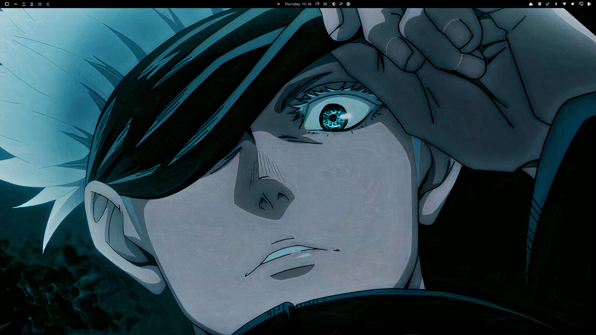
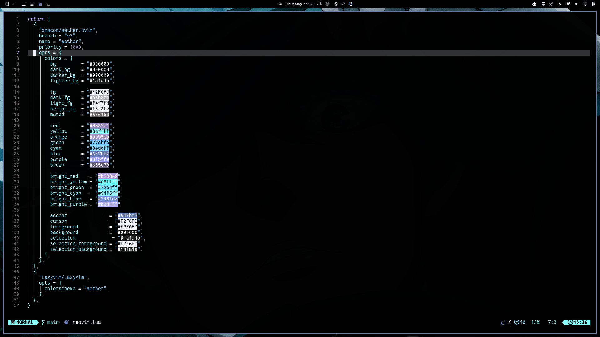

<div align="center">

# Omarchy Gojo Theme

**The strongest sorcerer of the Jujutsu world, now powering your Omarchy desktop.**

A pitch-black, Six Eyes–inspired theme for [Omarchy](https://omarchy.org/) — Arch Linux with grace. Pure `#000000` canvas, ice-blue accents, and Hollow Purple energy across every pixel of your workspace.


</div>

---

## Overview

Gojo, Satoru Gojo. The one recognized by the heavens. This theme translates his
aesthetic into a full desktop identity:

- **Void black** — pure `#000000` surfaces, no noise, maximum contrast.
- **Six Eyes blue** — the signature crystal-blue accent (`#647bb7`) frames active
  windows, cursors, and focus states.
- **Limitless cyan** — `#8eddff` / `#8affff` scan lines, syntax highlights, and
  progress bars like cursed energy overflowing.
- **Hollow Purple** — `#9f9ff0` and `#9a87c1` punches for selection, borders,
  and the occasional infinite void.

> Across Roppongi, at 7 PM, for theme-consultation purposes, I'll be free. *— Satoru Gojo, before getting to work.*

---

## Palette

Every color below is drawn from the theme's single source of truth, `colors.toml`.

### Core UI

| Token | Hex | Role |
|---|---|---|
| `background` / `bg` | `#000000` | Void black canvas |
| `foreground` / `fg` | `#F2F6FD` | Infinite Void white text |
| `accent` | `#647bb7` | Six Eyes blue |
| `cursor` | `#F2F6FD` | Reverse-video cursor |
| `lighter_bg` | `#1a1a1a` | Raised surfaces |
| `muted` | `#686163` | Dimmed / inactive |

### ANSI 0–15

| | Hex | | Hex |
|---|---|---|---|
| `color0` | `#000000` | `color8` | `#686163` |
| `color1` | `#9a87c1` | `color9` | `#b299e2` |
| `color2` | `#77cbfb` | `color10` | `#72e4ff` |
| `color3` | `#8affff` | `color11` | `#68ffff` |
| `color4` | `#647bb7` | `color12` | `#748fda` |
| `color5` | `#9f9ff0` | `color13` | `#b3b1ff` |
| `color6` | `#8eddff` | `color14` | `#91f5ff` |
| `color7` | `#F2F6FD` | `color15` | `#f1f5ff` |

---

## Coverage

This isn't just a wallpaper. Every layer of the Omarchy stack is themed:

| Layer | App | Config |
|---|---|---|
| **Compositor** | Hyprland borders | `hyprland.conf` |
| **Lock screen** | Hyprlock | `hyprlock.conf` |
| **Notifications** | Mako | `mako.ini` |
| **Bar / widgets** | Waybar | `waybar.css` |
| **Launchers** | Wofi, Walker | `wofi.css`, `walker.css` |
| **OSD** | SwayOSD | `swayosd.css` |
| **Browser** | Chromium (theme color) | `chromium.theme` |
| **Icons** | Icon set | `icons.theme` |
| **Terminals** | Alacritty, Foot, Kitty, Ghostty, Warp | `alacritty.toml`, `foot.ini`, `kitty.conf`, `ghostty.conf`, `warp.yaml` |
| **Editors** | Neovim (Aether), Zed, VS Code | `neovim.lua`, `aether.zed.json`, `vscode.json` |
| **Multiplexer** | Zellij | `zellij.kdl` |
| **System monitor** | Btop | `btop.theme` |
| **Discord** | Vencord (base16) | `vencord.theme.css` |
| **Wallpapers** | 5 Gojo wallpapers | `backgrounds/` |

---

## Screenshots

### Desktop



### Terminal



---

## Installation

Omarchy makes theming a first-class citizen. Install straight from this repo:

```bash
# 1. Clone the theme into your themes directory
omarchy theme install https://github.com/TheNeovimmer/omarchy-gojo-theme

# 2. Apply it
omarchy theme set omarchy-gojo-theme

# 3. Cycle into one of the bundled Gojo wallpapers
omarchy theme bg next
```

Prefer a manual install? Drop the repo into `~/.config/omarchy/themes/omarchy-gojo-theme/` and run `omarchy theme set omarchy-gojo-theme`.

---

## An expert note on how Omarchy themes you

The files in this repo follow Omarchy's theming contract. `colors.toml` is the
single source of truth — when you install a theme from a repo, Omarchy
**regenerates** the terminal configs (`alacritty.toml`, `foot.ini`,
`ghostty.conf`, `kitty.conf`), `vscode.json`, and every `*.lua` (Hyprland and
Neovim) from `colors.toml` at apply time, because those files know which
programs they launch. Everything else — `btop.theme`, `wofi.css`, `mako.ini`,
`zellij.kdl`, wallpapers, and so on — is kept **verbatim**.

That means:

- If you only tweak `colors.toml` (say, to cool the accent down), every
  regenerated app follows automatically.
- If you want to hand-tune a generated file, edit it **after** applying, or
  drop the theme locally (without a `.git` dir) so Omarchy treats it as your
  own and leaves every file untouched.

## Customizing

Overlay-style tweaks are the Omarchy-sanctioned way:

```bash
# Copy the theme under the same slug and edit freely
mkdir -p ~/.config/omarchy/themes/omarchy-gojo-theme
cp -r ./colors.toml ~/.config/omarchy/themes/omarchy-gojo-theme/
omarchy theme set omarchy-gojo-theme   # re-apply
```

Your changes survive updates because they live in `~/.config/`, never in
Omarchy's read-only `/usr/share/omarchy/themes/`.

## Uninstall

```bash
rm -rf ~/.config/omarchy/themes/omarchy-gojo-theme
omarchy theme set <another-theme>
```

---

## Credits

- **Theme by** [@TheNeovimmer](https://github.com/TheNeovimmer)
- Built on the color and tooling core shared by the [Aether](https://github.com/omacom/aether.nvim) family.
- Aesthetic inspired by **Satoru Gojo** from *Jujutsu Kaisen*. Not affiliated with the franchise — just homage.

## License

Distributed under the [MIT License](LICENSE.md).

<div align="center">

*Make sure to enjoy yourself. Hmm, take it easy, you know — my theme has no weakness.*

</div>